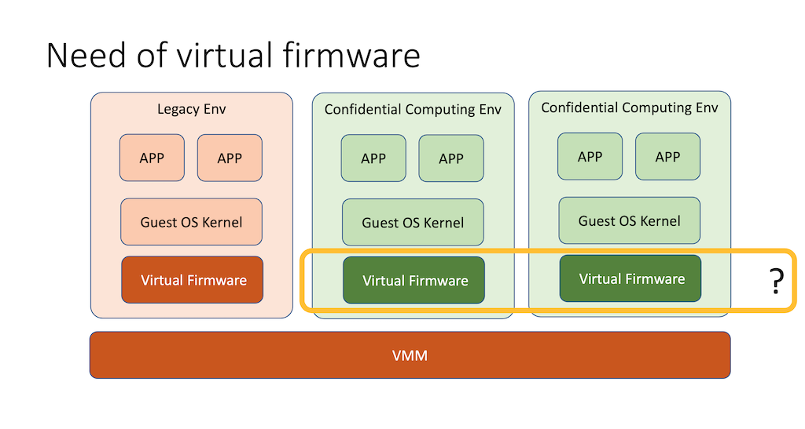

[](https://codecov.io/gh/liuw1/td-shim)
[](https://app.fossa.com/projects/git%2Bgithub.com%2Fconfidential-containers%2Ftd-shim?ref=badge_shield)
# TD-shim - Confidential Containers Shim Firmware

Hardware virtualization-based containers are designed to launch and run
containerized applications in hardware virtualized environments. While
containers usually run directly as bare-metal applications, using TD or VT as an
isolation layer from the host OS is used as a secure and efficient way of
building multi-tenant Cloud-native infrastructures (e.g. Kubernetes).

In order to match the short start-up time and resource consumption overhead of
bare-metal containers, runtime architectures for TD- and VT-based containers put
a strong focus on minimizing boot time. They must also launch the container
payload as quickly as possible. Hardware virtualization-based containers
typically run on top of simplified and customized Linux kernels to minimize the
overall guest boot time.

Simplified kernels typically have no UEFI dependencies and no ACPI ASL
support. This allows guests to boot without firmware dependencies. Current
VT-based container runtimes rely on VMMs that are capable of directly booting
into the guest kernel without loading firmware.

TD Shim is a simplified [TDX virtual firmware](doc/tdshim_spec#vfw) for the
simplified kernel for TD container. This document describes a lightweight
interface between the TD Shim and TD VMM and between the TD Shim and the
simplified kernel.



## Documents

* [Introduction (PDF)](doc/td-shim-introduction.pdf)
* [TD-Shim specification](doc/tdshim_spec.md)

## Feature Introduction

This is a Shim Firmware to support [Intel TDX](https://software.intel.com/content/www/us/en/develop/articles/intel-trust-domain-extensions.html).

The API specification is at [td-shim specification](doc/tdshim_spec.md).

The secure boot specification for td-shim is at [secure boot specification](doc/secure_boot.md)

The design is at [td-shim design](doc/design.md).

The threat model analysis is at [td-shim threat model](doc/threat_model.md).

## How to build

### Tools

1. Install [RUST](https://www.rust-lang.org/)

please use nightly-2022-05-15.

NOTE: We need install nightly version because we use cargo-xbuild.

1.1. Install xbuild

```
cargo install cargo-xbuild
```

Please reinstall cargo-xbuild, after you update the rust toolchain.

2. Install [NASM](https://www.nasm.us/)

Please make sure nasm can be found in PATH.

3. Install LLVM

Please make sure clang can be found in PATH.

Set env:

```
set CC_x86_64_unknown_uefi=clang
set AR_x86_64_unknown_uefi=llvm-ar

For Elf format payload build:
set CC_x86_64_unknown_none=clang
set AR_x86_64_unknown_none=llvm-ar
```

### Secure boot support

Please follow [Secure Boot Guide](doc/secure_boot_guide.md)

### Before build
```
git submodule update --init --recursive
./sh_script/preparation.sh
```

### Build TdShim
```
cargo xbuild -p td-shim --target x86_64-unknown-none --release --features=main,tdx
cargo run -p td-shim-tools --bin td-shim-ld -- target/x86_64-unknown-none/release/ResetVector.bin target/x86_64-unknown-none/release/td-shim -o target/release/final.bin
```

### Build TdShim to launch a executable payload
```
cargo xbuild -p td-shim --target x86_64-unknown-none --release --features=main,tdx --no-default-features
```

### Build PE format payload
```
cargo xbuild -p td-payload --target x86_64-unknown-uefi --release --features=main,tdx
cargo run -p td-shim-tools --bin td-shim-ld --no-default-features --features=linker -- target/x86_64-unknown-none/release/ResetVector.bin target/x86_64-unknown-none/release/td-shim -p target/x86_64-unknown-uefi/release/td-payload.efi -o target/release/final-pe.bin
```

### Build Elf format payload
```
cargo xbuild -p td-payload --target x86_64-unknown-none --release --features=main,tdx
cargo run -p td-shim-tools --bin td-shim-ld --no-default-features --features=linker -- target/x86_64-unknown-none/release/ResetVector.bin target/x86_64-unknown-none/release/td-shim -p target/x86_64-unknown-none/release/td-payload -o target/release/final-elf.bin
```

## Run
REF: https://github.com/tianocore/edk2-staging/tree/TDVF

```
./launch-rust-td.sh
```

## Code Contributions

1.  install [pre-commit](https://pre-commit.com/#install)
2.  run ```pre-commit install```
3.  when you run ```git commit```, pre-commit will do check-code things.

## Known limitation
This package is only the sample code to show the concept. It does not have a full validation such as robustness functional test and fuzzing test. It does not meet the production quality yet. Any codes including the API definition, the library and the drivers are subject to change.


## License
[](https://app.fossa.com/projects/git%2Bgithub.com%2Fconfidential-containers%2Ftd-shim?ref=badge_large)