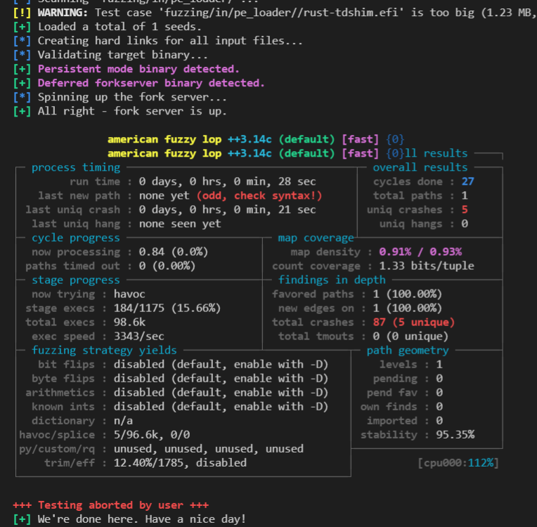

# rust fuzzing

## Setup

### Requirements

### Tools

- C compiler (e.g. gcc or clang)
- make

### Platform

afl.rs works on x86-64 Linux and x86-64 macOS.

`cargo install afl`

### Upgrading

`cargo install --force afl`

### Provide starting inputs

Use RAMdisks for input since, we don't want to destroy harddrives

```
$sudo mount -t tmpfs -o size=1024M tmpfs in
```


### Build the fuzz target

`cargo afl build -p fuzz_pe_loader`

### Start fuzzing

`cargo afl fuzz -i fuzz-target/in/pe_loader/ -o fuzz-target/out/ target/debug/fuzz_pe_loader`

As soon as you run this command, you should see AFL’s interface start up:



### view coverage

If you need to check coverage, follow the [coverage.md](./coverage.md) operation, Script fuzz_run.sh runs for a period fo time in each case.
Add the coverage string after the script collects info information and generates html files. The html file location is target/debug/fuzz_coverage.
If you need to run a specific case, please modify the cmd tuple in the script.
Can run at the same time but merge will cause problems

    ```
    # Install screen
    sudo apt install screen
    # Install expect
    sudo apt install expect
    # Run each fuzz for one hour
    bash fuzz_run.sh
    # Run each fuzz for one hour and generate source-based coverage report
    bash fuzz_run.sh Scoverage
    # Run each fuzz for one hour and generate gcov-based coverage report
    bash fuzz_run.sh Gcoverage

    # If there is an error in fuzzing, please follow, and switch to the root
    user to execute the command if the error is reported.

    [-] Hmm, your system is configured to send core dump notifications to an
    external utility. This will cause issues: there will be an extended delay
    between stumbling upon a crash and having this information relayed to the
    fuzzer via the standard waitpid() API.
    If you're just testing, set 'AFL_I_DONT_CARE_ABOUT_MISSING_CRASHES=1'.

    To avoid having crashes misinterpreted as timeouts, please log in as root
    and temporarily modify /proc/sys/kernel/core_pattern, like so:

    echo core >/proc/sys/kernel/core_pattern

    [-] Whoops, your system uses on-demand CPU frequency scaling, adjusted
    between 781 and 3808 MHz. Unfortunately, the scaling algorithm in the
    kernel is imperfect and can miss the short-lived processes spawned by
    afl-fuzz. To keep things moving, run these commands as root:

    cd /sys/devices/system/cpu
    echo performance | tee cpu*/cpufreq/scaling_governor

    You can later go back to the original state by replacing 'performance'
    with 'ondemand' or 'powersave'. If you don't want to change the settings,
    set AFL_SKIP_CPUFREQ to make afl-fuzz skip this check - but expect some
    performance drop.
    ```

## Single File Data Analysis

### Analyze a piece of data to run

If you have some data to test

```

`cargo  r -p package`

### Analyze the contents of a file as input

If some data is written in the file

```
    let mut args = std::env::args().skip(1);
    if let Some(arg) = args.next() {
        println!("{}", arg);
        let data = std::fs::read(arg).expect("read crash file fail");
        fuzz_pe_loader(data.as_slice());
    }
```
`cargo r -p package -- file_address`


## reference

[Rust Fuzz Book](https://rust-fuzz.github.io/book/afl/setup.html)
