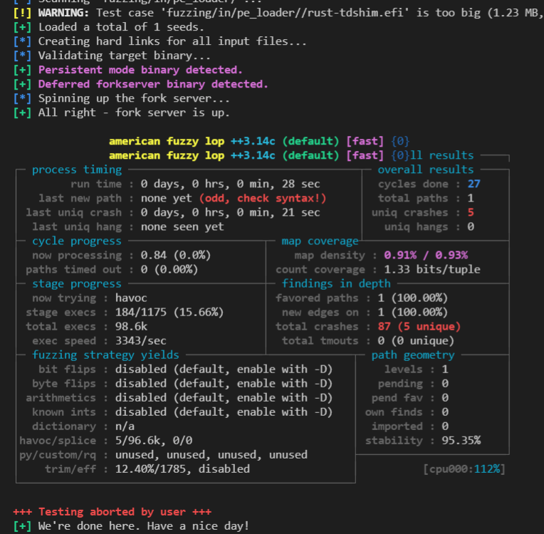

# Fuzzing with afl.rs

American fuzzy lop (AFL) is a popular, effective, and modern fuzz testing tool. afl.rs allows one to run AFL on code written in the Rust programming language.

## Setup

### Requirements

#### Tools
- C compiler (e.g. gcc or clang)
- make

#### Platform

Afl.rs works on x86-64 Linux and x86-64 macOS.

`$ cargo install cargo-afl`

### Upgrading

`$ cargo install --force cargo-afl`

## Provide starting inputs

Use RAMdisks for input since, we don't want to destroy harddrives.

```
$ cd fuzzing
$ sudo mount -t tmpfs -o size=1024M tmpfs in
```

### Build the fuzz target

`$ cd td-loader`
`$ cargo afl build --manifest-path fuzz/Cargo.toml --bin afl_pe --features fuzz --no-default-features`

### Example

`$ mkdir -p fuzz/artifacts/afl_pe`
`$ cargo afl fuzz -i fuzz/seeds/pe/ -o fuzz/artifacts/afl_pe fuzz/target/debug/afl_pe`

As soon as you run this command, you should see AFL’s interface start up:



### View coverage

If you need to view coverage, follow the steps below
```
# Viewing coverage reports requires installation
$ rustup component add llvm-tools-preview rust-src
$ cargo install grcov

# Set environment variable
$ export RUSTFLAGS="-C instrument-coverage"
$ export LLVM_PROFILE_FILE="fuzz-%p-%m.profraw"
$ cd td-loader

# Build 
$ find . -name "*.profraw" | xargs rm -rf
$ cargo afl build --manifest-path fuzz/Cargo.toml --bin afl_pe --features fuzz --no-default-features

# Run fuzz, press Ctrl + c when you want to stop
$ cargo afl fuzz -i fuzz/seeds/pe -o fuzz/artifacts/afl_pe fuzz/target/debug/afl_pe

# Generate report
$ grcov . -s . --binary-path fuzz/target/debug/afl_pe -t html --branch --ignore-not-existing -o coverage
```

### Automation test script
```

# Run single fuzzing test case
$ bash sh_script/fuzzing.sh -c [afl_pe/pe] -t 3600
# Run all fuzzing test cases
$ bash sh_script/fuzzing.sh -c [afl_all/libfuzzer_all] -t 3600

# If there is an error in fuzzing, please follow, and switch to the root
user to execute the command if the error is reported.

[-] Hmm, your system is configured to send core dump notifications to an
external utility. This will cause issues: there will be an extended delay
between stumbling upon a crash and having this information relayed to the
fuzzer via the standard `waitpid()` API.
If you're just testing, set `AFL_I_DONT_CARE_ABOUT_MISSING_CRASHES=1`.

To avoid having crashes misinterpreted as timeouts, please log in as `root`
and temporarily modify `/proc/sys/kernel/core_pattern`, like so:

$ echo core | sudo tee /proc/sys/kernel/core_pattern

[-] Whoops, your system uses on-demand CPU frequency scaling, adjusted
between 781 and 3808 MHz. Unfortunately, the scaling algorithm in the
kernel is imperfect and can miss the short-lived processes spawned by
afl-fuzz. To keep things moving, run these commands as root:

$ cd /sys/devices/system/cpu
$ echo performance | tee cpu*/cpufreq/scaling_governor

You can later go back to the original state by replacing `performance`
with `ondemand` or `powersave`. If you don't want to change the settings,
set `AFL_SKIP_CPUFREQ` to make afl-fuzz skip this check - but expect some
performance drop.
```

## Single File Data Analysis

### Analyze a piece of data to run

If you have some data to test.

`$ cargo  r -p package`

### Analyze the contents of a file as input

If some data is written in the file.

```
let mut args = std::env::args().skip(1);
if let Some(arg) = args.next() {
    println!("{}", arg);
    let data = std::fs::read(arg).expect("read crash file fail");
    fuzz_pe_loader(data.as_slice());
}
```
`$ cargo r -p package -- file_address`


## Reference

[Rust Fuzz Book](https://rust-fuzz.github.io/book/afl/setup.html)

* * * * 

# Fuzzing with cargo-fuzz

cargo-fuzz is the recommended tool for fuzz testing Rust code.

cargo-fuzz is itself not a fuzzer, but a tool to invoke a fuzzer. Currently, the only fuzzer it supports is libFuzzer (through the libfuzzer-sys crate), but it could be extended to support other fuzzers in the future.

## Setup 

### Requirements
libFuzzer needs LLVM sanitizer support, so this only works on x86-64 Linux, x86-64 macOS and Apple-Silicon (aarch64) macOS for now. This also needs a nightly compiler since it uses some unstable command-line flags. You'll also need a C++ compiler with C++11 support.

### Installing

```
$ cargo install cargo-fuzz

# Viewing coverage reports requires installation
$ rustup component add llvm-tools-preview rust-src
$ cargo install grcov
```
## Provide starting inputs

Use RAMdisks for input since, we don't want to destroy harddrives.

```
$ cd td-loader
$ mkdir fuzz/corpus
$ sudo mount -t tmpfs -o size=1024M tmpfs fuzz/corpus
```

### Example
Run an example like pe.
```
# If it is already in td-loader, please ignore this step.
$ cd td-loader
$ cargo fuzz list

# Copy the torrent to the default torrent folder, so you don't have to process the generated torrent file.
$ mkdir fuzz/corpus/pe
$ cp fuzz/seeds/pe/td-shim fuzz/corpus/pe


# Run pe fuzz.
$ cargo fuzz run pe
# If there are no errors it will keep running, you can use Ctrl + c to exit.
```

### View coverage

If you need to see the coverage of pe's running fuzz, Use the following command.
```
$ rm -rf fuzz/coverage
$ cargo fuzz coverage pe

# It Generate html to the corresponding folder.
$ grcov . -s . -b ./fuzz/target/x86_64-unknown-linux-gnu/release/pe -t html --branch --ignore-not-existing -o ./target/fuzz_coverage
```

## Reference

[Rust Fuzz Book](https://rust-fuzz.github.io/book/cargo-fuzz/setup.html)
