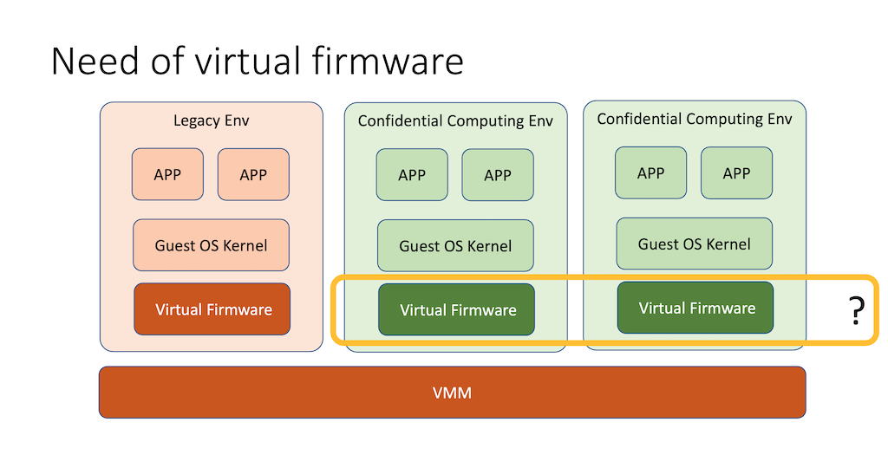

# TD-SHIM specification

version 0.7

Date: November 2023

## Background

Hardware virtualization-based containers are designed to launch and run
containerized applications in hardware virtualized environments. While
containers usually run directly as bare-metal applications, using TD or VT as an
isolation layer from the host OS is used as a secure and efficient way of
building multi-tenant Cloud-native infrastructures (e.g. Kubernetes).

In order to match the short start-up time and resource consumption overhead of
bare-metal containers, runtime architectures for TD- and VT-based containers put
a strong focus on minimizing boot time. They must also launch the container
payload as quickly as possible. Hardware virtualization-based containers
typically run on top of simplified and customized Linux kernels to minimize the
overall guest boot time.

Simplified kernels typically have no UEFI dependencies and no ACPI ASL
support. This allows guests to boot without firmware dependencies. Current
VT-based container runtimes rely on VMMs that are capable of directly booting
into the guest kernel without loading firmware.

TD Shim is a simplified [TDX virtual firmware](#vfw) for the simplified kernel for TD
container. This document describes a lightweight interface between the TD Shim
and TD VMM and between the TD Shim and the simplified kernel.



Terminology and references can be found [at the end of the document](#reference).

### Acknowledgments

TD-SHIM specification is contributed by following individuals:

**Contributors:**

* Jiaqi Gao &mdash; Intel Corporation
* Andi Kleen &mdash; Intel Corporation
* Jiang Liu &mdash; Alibaba Group
* Jun Nakajima &mdash; Intel Corporation
* Samuel Ortiz &mdash; Apple Inc.
* Qixuan Wu &mdash; Alibaba Group
* Jiewen Yao &mdash; Intel Corporation
* Jia Zhang &mdash; Alibaba Group

## Part 0 - Overview

### Design Philosophy

TD Shim is a lightweight layer between hypervisor and guest TD kernel.

TD Shim is in the Trust Computing Base (TCB). It shall be as simple as possible.

TD Shim shall NOT include any advance features which may exist in a normal guest
firmware, such as network stack, file system, UEFI, virtio, etc. If those
features are really required, a specific boot payload on top of TD Shim is
preferred.

TD Shim shall NOT provide any runtime services, such as UEFI Runtime, ACPI ASL,
SMM, or event exception handler for OS Kernel.

### Boot Process

1.	VMM loads TDX module.

NOTE: For detail, please refer to [Intel TDX Module 1.0 EAS](#eas), Section 2.1 and
Chapter 12 – Intel TDX Module Lifecycle.

2.	VMM loads TD Shim and payload (kernel)
 * VMM parses the TD Shim metadata.
 * VMM allocates memory for the TD.
 * VMM loads TD Shim and payload to TD memory.
 * VMM also prepares the TD_HOB ([Hand-off Block](#td-hob)), the boot
   configuration for TD Shim and payload command line parameter, then loads them
   to TD memory.
 * VMM uses SEAMCALL[TDH.MEM.PAGE.ADD] to add private pages, where this memory
   includes the initialized data.
    * VMM uses SEAMCALL[TDH.MR.EXTEND] to extend initialized memory, such as TD
      Shim and payload. To save the boot time, there is no need to uninitialized
      memory, such as stack or heap.
    * After VMM extends all memory, VMM uses SEAMCALL[TDH.MR.FINALIZE].
 * VMM uses SEAMCALL[TDH.MEM.PAGE.AUG] to add rest unaccepted pages, which
   requires the TD to use TDCALL[TDG.MEM.PAGE.ACCEPT] to accept this memory
   before use it.
 * VMM enters the TD by using SEAMCALL[TDH.VP.ENTER].

NOTE: This flow just shows the VMM basic flow on how the VMM loads the TD
memory. For more detail of the full TD launch process, please refer to [Intel TDX
Module 1.0 EAS](#eas), Section 2.2 – Guest TD Life Cycle Overview. For more detail of
adding private page at TD build time, please refer to [Intel TDX Module 1.0 EAS](#eas),
Section 7.7 – Secure EPT Build and Update and Section 7.8 – Adding TD Private
Pages during TD Build Time.

3.	TD Shim boots
 * TD Shim starts at the reset vector in 32bit protected mode. It sets up page
   table and switch to 64bit long mode immediately.
 * TD Shim uses TDCALL[TDG.VP.INFO] to get the virtual CPU (VCPU) information
   and only allows the bootstrap processor (BSP) to start the system
   initialization. All application processors (APs) loops with a mailbox and
   wait for the instruction from the BSP.
 * TD Shim setup stack and starts to run the C code.
 * TD Shim setup exception handler.
 * TD Shim uses TDCALL[TDG.MR.RTMR.EXTEND] to extend the TD_HOB to runtime
   measurement register (RTMR) with, then parse the TD_HOB.
 * TD Shim gets the memory information and accepts the memory. It also maintains
   the memory map.

NOTE: TD Shim shall build the trusted chain by extending the component to RTMR
before use. All input from the VMM shall be extended unless it is already
measured in TD measurement register (MRTD).

4.	TD Shim loads payload
 * TD Shim measures the payload parameter to RTMR.
 * TD Shim prepares the payload parameter, such as boot params (zero page) for
   the OS kernel, E820 table and ACPI tables, etc.
 * TD Shim jumps to the payload’s entrypoint.

## Part I - TD Shim / VMM Interface

### TD Shim Metadata

TD Shim image contains a metadata table to report the TD Shim information to the
VMM. The metadata table is also known as the TDVF_DESCRIPTOR. The VMM refers to
TDVF_DESCRIPTOR to set up memory for TD Shim. The VMM shall follow the
MemoryAddress defined in each TDVF_SECTION to reserve system memory and load
corresponding components.

#### Metadata Location

The TD Shim metadata can be located at (TD Shim end – 0x20) byte. It is a
4-bytes offset of the TDVF_DESCRIPTOR to the beginning of the TD Shim image.

#### Metadata Definition

**Table 1.1-1 TDVF_DESCRIPTOR definition**

| Field                | Offset (Byte) | Type            | Size (Byte) | Description                            |
|:---------------------|:--------------|:----------------|:------------|:---------------------------------------|
| Signature            | 0             | CHAR8[4]        | 4           | 'TDVF' signature                       |
| Length               | 4             | UINT32          | 4           | Size of the structure (d)              |
| Version              | 8             | UINT32          | 4           | Version of the structure. It must be 1.|
| NumberOfSectionEntry | 12            | UINT32          | 4           | Number of the section entry (n)        |
| SectionEntries       | 16            | TDVF_SECTION[n] | 32*n        | See Table 1.1-2.                       |

**Table 1.1-2 TDVF_SECTION definition**

| Field                | Offset (Byte) | Type            | Size (Byte) | Description                            |
|:---------------------|:--------------|:----------------|:------------|:---------------------------------------|
| DataOffset           | 0             | UINT32          | 4           | The offset to the raw section in the binary image. |
| RawDataSize          | 4             | UINT32          | 4           | The size of the raw section in the image.<br/><br/>If it is zero, the VMM shall allocate zero memory from MemoryAddress to (MemoryAddress + MemoryDataSize).<br/><br/>If it is zero, then the DataOffset shall also be zero. |
| MemoryAddress        | 8             | UINT64          | 8           | The guest physical address of the section loaded.<br/>It must be 4K aligned.<br/>Zero means no action for the VMM. |
| MemoryDataSize       | 16            | UINT64          | 8           | The size of the section loaded.<br/>It must be 4K aligned.<br/>It must be not less than RawDataSize, if it is non-zero.<br/><br/>If MemoryDataSize is greater than RawDataSize, the VMM shall fill zero up to the MemoryDataSize.<br/>Zero means no action for the VMM. |
| Type                 | 24            | UINT32          | 4           | The type of the TDVF_SECTION. See table 1.1-4. |
| Attributes           | 28            | UINT32          | 4           | The attribute of the section. See Table 1.1-3. |

**Table 1.1-3 TDVF_DESCTION.Attributes definition**

| Bits | Name            | Description                            |
|:-----|:----------------|:---------------------------------------|
| 0    | MR.EXTEND       | If the VMM need use TDCALL [TDH.MR.EXTEND] for this section.<br/>0: Do not need TDCALL [TDH.MR.EXTEND]<br/>1: Need TDCALL [TDH.MR.EXTEND]<br/><br/>For example, BFV sets to 1. CFV/TD_HOB/TempMem/PermMem set to 0.<br/>The Payload sets 1 or 0. The  PayloadParam sets to 0. |
| 1    | PAGE.AUG        | If the VMM need use TDCALL [TDH.MEM.PAGE.AUG] for this section.<br/>0: Use TDCALL [TDH.MEM.PAGE.ADD]<br/>1: Use TDCALL [TDH.MEM.PAGE.AUG]<br/><br/>For example, PermMem sets be 1. Others set to 0. |
| 31:2 | Reserved        | Must be 0.                             |

**Table 1.1-4 TDVF_SECTION.Type definition**

| Value          | Name         | Memory Type       | VMM Action              | Td-Shim Action | Measurement       |
|:---------------|:-------------|:------------------|:------------------------|:---------------|:------------------|
| 0              | BFV          | Private Memory    | PAGE.ADD + MR.EXTEND    | N/A            | MRTD              |
| 1              | CFV          | Private Memory    | PAGE.ADD                | RTMR.EXTEND    | RTMR[0]           |
| 2              | TD_HOB       | Private Memory    | PAGE.ADD                | RTMR.EXTEND    | RTMR[0]           |
| 3              | TempMem      | Private Memory    | PAGE.ADD                | N/A            | N/A               |
| 4              | PermMem      | Unaccepted Memory | PAGE.AUG                | PAGE.ACCEPT    | N/A               |
| 5              | Payload      | Private Memory    | PAGE.ADD + MR.EXTEND(o) | RTMR.EXTEND(o) | MRTD (or) RTMR[1] |
| 6              | PayloadParam | Private Memory    | PAGE.ADD                | RTMR.EXTEND    | RTMR[1]           |
| 7              | TD_INFO      | Private Memory    | N/A                     | N/A            | N/A               |
| 8 ~ 0xFFFFFFFF | Reserved     | N/A               | N/A                     | N/A            | N/A               |

Rules for the TDVF_SECTION:
 * A TD-Shim shall include at least one BFV and the reset vector shall be inside
   of BFV. The RawDataSize of BFV must be non-zero.
 * A TD-Shim may have zero, one or multiple CFVs. The RawDataSize of CFV must be
   non-zero.
 * A TD-Shim may have zero or one TD_HOB section. The RawDataSize of TD_HOB must
   be zero. If TD-Shim reports zero TD_HOB section, then TD-Shim shall report
   all required memory in PermMem section.
 * A TD-Shim may have zero, one or multiple TempMem. The RawDataSize of TempMem must be
   zero.
 * A TD-Shim may have zero, one or multiple PermMem section. The RawDataSize of
   PermMem must be zero. If a TD provides PermMem section, that means the TD
   will own the memory allocation. VMM shall allocate the permanent memory for
   this TD. TD will NOT use the system memory information in the TD HOB. Even if
   VMM adds system memory information in the TD HOB, it will ne ignored.
 * A TD-Shim may have zero or one Payload. The RawDataSize of Payload must be
   non-zero, if the whole image includes the Payload. Otherwise the RawDataSize
   must be zero.
 * A TD-Shim may have zero or one PayloadParam.  PayloadParam is present only if
   the Payload is present.
 * A TDVF may have zero or one TD_INFO section. If present, it shall be included
   in BFV section. MemoryAddress and MemoryDataSize shall be zero. See Table 1.1-5.

**Table 1.1-5 TD_INFO definition**

| Field   | Offset (Byte) | Type   | Size (Byte) | Description                            |
|:--------|:--------------|:-------|:------------|:---------------------------------------|
| GUID    | 0             | GUID   | 16          | The GUID for the TD-SHIM. |
| Length  | 16            | UINT32 | 4           | Length of the full structure, including the GUID. |
| Version | 20            | UINT32 | 4           | The version of the TDVF. 0 means unsupported. |
| SVN     | 24            | UINT32 | 4           | The Security Version Number of TDVF. It must be Monotonically increasing. 0 means unsupported. |
| Data    | 28            | -      | N           | GUID specific data. |

### Metadata Reporting Use case

The metadata above may support below use cases as example.

1. Normal TDVF: The metadata includes one BFV, one CFV, one TD_HOB and multiple
   TempMem.
2. TD-Shim with container OS: The metadata includes one BFV, one TD_HOB, multiple
   TempMem and one OS kernel as Payload. The OS kernel is added so that the
   TD-Shim does not need load it from other storage.
3. TD-Shim with Service TD core: The metadata includes one BFV, zero or one CFV,
   multiple TempMem, one PermMem, and one Service TD Core as Payload. The TD_HOB is
   removed and the PermMem is added, so that the configuration is static, and
   all measurement registers are predictable at build time.

## Part II - VMM / TD Shim Interface

### TD HOB

The HOB data structure is defined in [UEFI Platform Initialization (PI)](#pinit)
specification, volume 3 - Shared Architectural Elements, Chapter 5 - HOB Code
Definitions.  The TD HOB list starts with EFI_HOB_HANDOFF_INFO_TABLE (PHIT HOB),
where only Header, Version and EfiEndOfHobList are useful. All other fields
shall be zero. The EfiEndOfHobList points the end of the HOB list. If present,
the PHIT HOB and End Of List HOB are required. All other HOBs are options.

In order to initialize a TD starts, the VMM uses SEAMCALL[TDH.VP.INIT] with an
TD HOB address in RDX. The TDX module puts this TD HOB address in RCX/R8 as VCPU
INIT state. Because the TD HOB address is an input from VMM, it is
untrusted. For detail, please refer to [Intel TDX Module 1.0 EAS](#eas), Section
8.1 TD VCPU Initial State and Section 20.2.42 TDH.VP.INIT.

TD HOB is untrusted data from VMM. The TD Shim shall measure the TD HOB content
to RTMR[0] before consume it.

#### Memory Information

Resource Description HOB is to report the VMM assigned memory information.

If TD Shim does not include the PermMem section in metadata, then the VMM shall
report the unaccepted memory via TD HOB. The unaccepted memory should be
reported as TD Resource HOB with type: EFI_RESOURCE_SYSTEM_MEMORY and attribute:
EFI_RESOURCE_ATTRIBUTE_PRESENT | EFI_RESOURCE_ATTRIBUTE_INITIALIZED |EFI_RESOURCE_ATTRIBUTE_UNACCEPTED.
The accepted memory information is optional, because the TD Shim can get the
information from metadata directly. The TD Shim shall always consume the data
from metadata, to ensure that the TD Shim will not accept the already accepted
data again.

If TD Shim reports the PermMem section in metadata, then the VMM does not need
report unaccepted memory via TD HOB. If nothing else should be reported, then
the TD HOB could be NULL.

#### Resource Information

VMM also uses the Resource Description HOB to report the emulated MMIO
(EFI_RESOURCE_MEMORY_MAPPED_IO) and IO resource (EFI_RESOURCE_IO), such as for
timer, interrupt controller or virtual PCI express.

#### System Configuration

The VMM may optionally report other system configuration via GUID Extension HOB,
such as ACPI table. The TD Shim shall convert the HOB to report to OS with TD
Shim / Guest payload interface.

### GUID Extension HOB definition

#### ACPI GUID Extension HOB

A HOB may include zero, one or multiple ACPI Table GUID Extension HOB. It is the
ACPI table prepared by the VMM to the guest OS. The TD Shim shall move the ACPI
tables from HOB to ACPI Reclaim memory one by one, and report to guest payload
via normal ACPI mechanism via RSDP.

```
#define ACPI_TABLE_HOB_GUID { \
0x6a0c5870, 0xd4ed, 0x44f4, {0xa1, 0x35, 0xdd, 0x23, 0x8b, 0x6f, 0xc, 0x8d } \
}

#pragma pack (1)

typedef struct {
  EFI_HOB_GENERIC_HEADER Header; // normal GUID HOB header
  EFI_GUID               Name;   // ACPI_TABLE_HOB_GUID

  // One ACPI table, started with Signature
  // Length in AcpiTable shall match the length in HOB Header.
  UINT8                  AcpiTable[];
} ACPI_TABLE_HOB;

#pragma pack ()
```

#### E820 Memory Map GUID Extension HOB

A HOB may include zero or one E820 memory map Table GUID Extension HOB. If
present, this HOB is used to describe the memory information with E820
table. The E820 table definition can be found at
https://uefi.org/specs/ACPI/6.4/15_System_Address_Map_Interfaces/Sys_Address_Map_Interfaces.html#.

```
#define E820_TABLE_HOB_GUID { \
0x8f8072ea, 0x3486, 0x4b47, {0x86, 0xa7, 0x23, 0x53, 0xb8, 0x8a, 0x87, 0x73 } \
}

#pragma pack (1)

typedef struct {
  EFI_HOB_GENERIC_HEADER Header; // normal GUID HOB header
  EFI_GUID               Name;   // E820_TABLE_HOB_GUID

  // One E820 table containing multiple E820 entries
  E820_TABLE_ENTRY       E820Table[];
} E820_TABLE_HOB;

typedef struct {
  UINT64                 Address;
  UINT64                 Size;
  UINT32                 Type;
} E820_TABLE_ENTRY;

#pragma pack ()
```

#### TD Payload Info GUID Extension HOB

A HOB may include zero or one payload Info GUID Extension HOB. If it is present,
then the TD Shim shall follow the payload image type and boot protocol, then
jump the corresponding payload entrypoint.

A TD Shim may support a subset of the payload type based upon its use case. For
example, TD Shim for a container may only support PayloadImageTypeBzImage and
PayloadImageTypeRawVmLinux. TD shim for a service TD may only support
PayloadImageTypeExecutablePayload.

If the VMM does not provide the payload image or the VMM does not know the
payload image format, the VMM shall not create this payload info HOB. The TdShim
must know the payload format and transfer to the payload in right way.

```
#define HOB_PAYLOAD_INFO_GUID { \
0xb96fa412, 0x461f, 0x4be3, {0x8c, 0xd, 0xad, 0x80, 0x5a, 0x49, 0x7a, 0xc0 } \
}

#pragma pack (1)

typedef struct {
  EFI_HOB_GENERIC_HEADER Header; // normal GUID HOB header
  EFI_GUID               Name;   // TD_HOB_PAYLOAD_ENTRYPOINT_GUID

  // TD_PAYLOAD_IMAGE_TYPE
  UINT32                 ImageType;

  // Reserved field
  UINT32                 Reserved;

  // Guest physical address of the payload entrypoint.
  UINT64                 Entrypoint;
} HOB_PAYLOAD_INFO_TABLE;

typedef enum {

  // Payload Binary is a PE/COFF or ELF executable image as payload.
  // Entrypoint can be found by parsing the image header.
  // This type image does not follow Linux boot protocol.
  // A payload HOB is used to pass data from TdShim to payload.
  PayloadImageTypeExecutablePayload,

  // Payload Binary is bzImage, follow Linux boot protocol.
  // The first 512 bytes are boot_param. (zero page)
  // The entrypoint is start address of loaded 64bit Linux kernel
  //   plus 0x200
  PayloadImageTypeBzImage,

  // Payload Binary is vmlinux, follow Linux boot protocol.
  // It's an ELF64 binary image.
  PayloadImageTypeVmLinux,

  // Payload Binary is VMM loaded vmLinux, follow Linux boot protocol.
  // The entrypoint is defined at HOB_PAYLOAD_INFO_TABLE.Entrypoint.
  PayloadImageTypeRawVmLinux,

} PAYLOAD_IMAGE_TYPE;

#pragma pack ()
```

If the final binary includes a payload and the TD Shim knows the payload type,
then TD shim does not rely on VMM input. TD shim can boot payload directly. VMM
does not need to know payload and VMM does not need detect the payload type or
provide the payload type information to TD Shim.

If the final binary does not include a payload and TD Shim relies on VMM to
input the payload, then VMM needs to know the payload and provides the payload
type information to TD Shim.

### Payload Loading

The VMM shall load the payload such as Linux kernel (bzImage or vmlinux) and
optional driver (initrd.img) with payload command line parameter into TD private
memory if they are supported in TD metadata. The payload may or might not be
included in the binary and the payload may or might not be measured in MRTD
based upon different use cases. If the payload image is not measured in MRTD,
then it shall be measured to RTMR[1].

NOTE: The VMM does not need create the payload boot params, such as the Linux
boot zero page, but just create a payload boot command line parameter (a string,
please refer to [Kernel parameters](#kparms). It is TD Shim that setup the
required OS kernel boot_params (the zero page). See Part III for detail.


## Part III - TD Shim / Guest Payload Interface

### Boot Protocol

If the payload follows Linux Boot Protocol, TD Shim shall follow 64bit boot
protocol defined in the [Linux boot process](#boot) setup the boot_params (the
[zero page](#zeropage)), then jump to the 64-bit payload entry point according
to the TD Payload Info GUID Extension HOB.

The bootstrap processor state is below:
 * CPU must be in 64-bit mode with paging enabled.
 * The range with setup_header.init_size from start address of loaded Linux
   kernel, zero page and Linux kernel command line parameter buffer get
   identical mapping.
 * A GDT must be loaded with below configuration
    * CS=0x10, 4G flat segment, with execute/read permission.
    * DS=0x18, 4G flat segment, with read/write permission.
    * ES=DS.
    * SS=DS.
 * Interrupt must be disabled.
 * RSI must hold the base address of the struct boot_params.

If the payload does not follow Linux Boot Protocol, TD Shim shall follow X64
calling convention to call the kernel entrypoint and pass a new payload HOB as
the first parameter, and the memory address where the payload is loaded as the
second parameter.
 * For PE/COFF image, MSVC X64 calling convention must be used. RCX must hold
   the payload HOB address, RDX must hold the address where payload is loaded.
 * For ELF image, System-V ABI AMD64 calling convention must be used. RDI must
   hold the payload HOB address, RSI must hold the address where payload is
   loaded.
 * All rest are same as above.

### UEFI Interface

TD Shim shall only NOT support UEFI interface. If the TD guest requires to boot
an UEFI OS, the TD Shim may load a special UEFI payload to support UEFI
interface and UEFI OS kernel boot.

### ACPI Tables

TD Shim shall only support [static ACPI tables](#acpi-prog). TD Shim shall not
report any ACPI table that contains the ASL such as DSDT or SSDT, unless the VMM
passes the DSDT or SSDT via ACPI_TABLE_HOB.

The root of ACPI table is RSDP. For the payload supporting Linux Boot Protocol,
the TD Shim shall report RSDP as part of [boot parameter](#bootparam) -
acpi_rsdp_addr (offset 0x70).

TD Shim does not report RSDP in any legacy region, such as EBDA or BIOS
[read-only memory space](#acpi-rdsp).

For the payload not supporting Linux Boot Protocol, the TD Shim shall report
ACPI table via ACPI Extension HOB.

TD Shim shall support a minimal set of ACPI tables. ACPI specification defined
[RSDP](#acpi-rdsp), [XSDT](#acpi-xsdt), [MADT](#acpi-madt) tables are required
to report system information.

 * Within MADT, the Processor Local APIC/x2 APIC, IO APIC, Interrupt Source
   Override, Local APIC NMI, Multiprocessor Wakeup structures are required.
 * FADT is required, if we need pass the reduced hardware information to guest,
   such as RESET_REG.
 * SRAT is required, only if the hypervisor configures Non-Uniform Memory Access
   (NUMA) platform.
 * Intel TDX defined CCEL table is required to support TDX based trusted boot.
 * TCG defined TCG2 table is required, if the virtual TPM2 device is supported
   in the future.
 * PCI-SIG defined MCFG table is required, if the virtual PCI express is
   supported.
 * TD Shim defined SPRT table is required, if the virtual PCI device is
   supported.

#### Multiple Processor Support

Because the Intel TDX module initializes all CPUs and allows them to jump to the
reset vector at the same time, the TD Shim shall rendezvous all processor, and
only let the BSP does the TD initialization and lets APs do wait-loop in the X64
long mode.

The AP init state is exactly same as the BSP init state. The TD Shim uses
TDCALL[TDG.VP.INFO] to get the TD_INFO. The VCPU_INDEX is reported by
INIT_STATE.RSI or TD_INFO.R9[0:31]. It is the starting from 0 and allocated
sequentially on each successful SEAMCALL[TDH.SYS.LP.INIT].

The NUM_VCPUS is reported by TD_INFO.R8[0:31]. It is the Number of Virtual CPUs
that are usable, i.e. either active or ready. The TD Shim need use this number
to determine how many CPUs will join.

The MAX_VCPUS is reported by TD_INFO.R8[32:63]. It is TD's maximum number of
Virtual CPUs. This value should be ignored by the TD Shim in this version. It
may be used for other purpose in future version such as later-add.

Intel TDX module will start the VCPU with VCPU_INDEX from 0 to (NUM_VCPUS –
1). As such, the TD Shim can treat the BSP as the CPU with
VCPU_INDEX 0. However, the TD Shim cannot assume that the CPU with VCPU_INDEX 0
is the first one to launch. The TD Shim needs to rendezvous in early
initialization code, let the BSP execute the main boot flow and let APs execute
in the wait loop.

TD Shim shall report the multiple processor information via [MADT](#acpi-madt).

In order to support AP wake up, TD Shim shall report [multiprocessor wakeup
structure](#acpi-mpws) in MADT to share mailbox information with the payload or
OS kernel, and send the OS commands via ACPI mailbox to wakeup APs.

The page table for AP shall be in reserved memory or ACPI Nvs in memory map.
The AP shall map the 4K OS wakeup page and the required memory for itself,
such as the mailbox, the page table itself, the exception handler, etc. These
shall also be in the reserved memory. The mailbox and OS wake page shall be
marked as read/write and executable.

The expectation for OS is that: OS shall setup its own GDT/IDT/CR3 in the 4KB
OS wakeup page immediately and jump to anywhere supported by OS page table.

NOTE: In TDX architecture, the VMM is not trusted. The TD does not give AP
control back to VMM, once the AP is launched into the TD. This behavior is
different with traditional VM, where the AP is not initialized yet and in
WAIT-FOR-SIPI state. As such, TDX architecture does not support traditional
INIT-SIPI-SIPI style wait up with local APIC, but only allows the payload or OS
kernel uses the mailbox mechanism to pull AP into its own domain.

#### PCI Interrupt Routing

If VMM does not pass DSDT, VMM needs a way to replace _PRT method in ASL. This
is done by Simple Static PCI Routing Table (SPRT). This table reports the PCI
device routing information in legacy way, which is similar to PCI Interrupt
Routing table in PCI Firmware Specification, section 2.6.2, Get PCI Interrupt
Routing Expansions, and I/O Interrupt Assignment Entries in Multi-Processor
Specification, 4.3.4, I/O Interrupt Assignment Entries.

TODO: Need reserve the table signature in ACPI spec.

**Table 3.3-1 Simple Static PCI Routing Table**

| Field              | Byte Length | Byte Offset | Description                                                               |
|:-------------------|:------------|:------------|:--------------------------------------------------------------------------|
| Header             |             |             |                                                                           |
| --Signature        | 4           | 0           | 'SPRT' Signature.                                                         |
| --Length           | 4           | 4           | Length, in bytes, of the entire Table.                                    |
| --Revision         | 1           | 8           | 1                                                                         |
| --Checksum         | 1           | 9           | Entire table must sum to zero.                                            |
| --OEMID            | 6           | 10          | Standard ACPI header                                                      |
| --OEM Table ID     | 8           | 16          | Standard ACPI header                                                      |
| --OEM Revision     | 4           | 24          | Standard ACPI header                                                      |
| --Creator ID       | 4           | 28          | Standard ACPI header                                                      |
| --Creator Revision | 4           | 32          | Standard ACPI header                                                      |
| Flags              | 4           | 36          | See SPRT Flags in Table 3.3-2.                                            |
| Entry Fields       | N           | 40          | The Entry fields according to the Flags. See Table 3.3-3 and Table 3.3-4. |

**Table 3.3-2 SPRT Flags**

| Field              | Bit  Length | Bit  Offset | Description                                                               |
|:-------------------|:------------|:------------|:--------------------------------------------------------------------------|
| Mode               | 1           | 0           | 0 – PIC Mode. Entry Fields follows PCI Interrupt Routing Entry in Table 2.3-3.<br/>1 – APIC Mode. Entry Fields follows I/O Interrupt Entry in Table 2.3-4. |
| Reserved           | 31          | 1           | Reserved. Must be 0.                                                      |

**Table 3.3-3 SPRT Mapping Table – PCI Interrupt Routing Entry Fields (in PIC mode)**

| Field                | Byte Length | Byte Offset | Description                                                               |
|:---------------------|:------------|:------------|:--------------------------------------------------------------------------|
| PCI Bus Number       | 1           | 0           | PCI Bus Number                                                            |
| PCI Device Number    | 1           | 1           | Bit[0:4] PCI Device Number<br/>Bit[5:7] Reserved                          |
| Link Value for INTA# | 1           | 2           | Link Value for INTA#                                                      |
| IRQ Bitmap for INTA# | 2           | 3           | IRQ Bitmap for INTA#                                                      |
| Link Value for INTB# | 1           | 5           | Link Value for INTB#                                                      |
| IRQ Bitmap for INTB# | 2           | 6           | IRQ Bitmap for INTB#                                                      |
| Link Value for INTC# | 1           | 8           | Link Value for INTC#                                                      |
| IRQ Bitmap for INTC# | 2           | 9           | IRQ Bitmap for INTC#                                                      |
| Link Value for INTD# | 1           | 11          | Link Value for INTD#                                                      |
| IRQ Bitmap for INTD# | 2           | 12          | IRQ Bitmap for INTD#                                                      |
| Slot Number          | 1           | 14          | Slot Number                                                               |
| Reserved             | 1           | 15          | Reserved                                                                  |

**Table 3.3-4 SPRT Mapping Table - I/O Interrupt Entry Fields (in APIC mode)**

| Field                       | Byte Length | Byte Offset | Description                                                               |
|:----------------------------|:------------|:------------|:--------------------------------------------------------------------------|
| ENTRY TYPE                  | 1           | 0           | Entry type 3 - I/O Interrupt Entry Fields                                 |
| INTERRUPT TYPE              | 1           | 1           | 0: INT Signal is a vectored interrupt; vector is supplied by APIC redirection table.<br/>3: ExtINT Signal is a vectored interrupt; vector is supplied by external PIC. For example, if an 8259 is used as the external PIC, the source is the 8259 INTR output line, and the vector is supplied by the 8259.|
| Attribute                   | 1           | 2           | Bit [0:1] Polarity of APIC I/O input signals:<br/>00 = Conforms to specifications of bus<br/>01 = Active high<br/>10 = Reserved<br/>11 = Active low<br/>Bit [2:3] Trigger mode of APIC I/O input signals:<br/>00 = Conforms to specifications of bus<br/>01 = Edge-triggered<br/>10 = Reserved<br/>11 = Level-triggered<br/>Bit [4:7] Reserved |
| Reserved                    | 1           | 3           | 0                                                                         |
| Source Bus ID               | 1           | 4           | PCI Bus Number, assigned by the BIOS.                                     |
| Source Bus IRQ              | 1           | 5           | Bit[0:1] Identifies the PCI interrupt signal, where 0x0 corresponds to INT_A#, 0x1 to INT_B#, 0x2 to INT_C# and 0x3 to INT_D#.<br/>Bit[2:6] Gives the PCI Device Number where the interrupt originates.<br/>Bit[7] Reserved |
| Destination I/O APIC ID     | 1           | 6           | Identifies the I/O APIC to which the signal is connected. It shall match the one in MADT I/O APIC Structure.<br/>If the ID is 0FFh, the signal is connected to all I/O APICs. |
| Destination I/O APIC INTIN# | 1           | 7           | Identifies the INTINn pin to which the signal is connected. |

#### Device Reporting

TD Shim does not report device to TD guest. The VMM may include the device in
the boot parameter, or Flattened Device Tree (FDT).

#### Resource Reporting

The VMM may have emulated MMIO or IO region for the TD. The VMM may include the
information in the boot parameter together the device such as basic timer or
interrupt controller device, or VMM may combine the device information into a
FDT and pass to the OS Kernel.

The ACPI table can be used to report detail register information. FADT is to
report the fixed hardware ACPI information such as PM_TIMER, PM_CONTROL, RESET
register. MADT is to report the Local APIC and IO APIC information. HPET is to
report HPET timer information. MCFG is to report PCI express configuration space
information.

### Memory Map

The memory in the TD guest-environment can be:
 * Private memory - SEAMCALL [TDH.MEM.PAGE.ADD] by VMM or TDCALL
   [TDG.MEM.PAGE.ACCEPT] by TD-Shim with S-bit clear in page table.
 * Shared memory - SEAMCALL [TDH.MEM.PAGE.ADD] by VMM or TDCALL
   [TDG.MEM.PAGE.ACCEPT] by TD-Shim with S-bit set in page table.
 * Unaccepted memory - SEAMCALL [TDH.MEM.PAGE.AUG] by VMM and not accepted by
   TD-Shim yet.
 * Memory-mapped IO (MMIO) - Shared memory accessed by TD via TDCALL
   [TDG.VP.VMCALL] <#VE.REQUESTMMIO>.

If a TD-memory region is private memory, the TD Shim shall have the final memory
map report the region with AddressRangeMemory, AddressRangeReserved,
AddressRangeACPI, or AddressRangeNVS.

If a TD-memory region is shared memory, the TD Shim shall convert it to private
memory before transfer to a payload.

If a TD-memory region is unaccepted memory and requires TDCALL
[TDG.MEM.PAGE.ACCEPT] in the guest TD payload, then the TD Shim shall mark this
region as unaccepted momory to payload. For the payload supporting Linux Boot
Protocol, the TD Shim shall have the final memory map report this region
with AddressRangeMemory and build a bitmap for all the system memory to mark
whether each 2MB size page has been accepted or not. A bit set to 1 in
bitmap indicates that the corresponding page has not been accepted yet. The
TD Shim shall write the 64-bit bitmap address to boot parameter
([offset 0x78](https://github.com/intel/tdx/blob/guest-unaccepted-memory/Documentation/x86/zero-page.rst)).
and report the bitmap memory as AddressRangeMemory in E820 table. For the
payload not supporting Linux Boot Protocol, the TD Shim shall have the final
memory map report unaccepted memory region with AddressRangeUnaccepted.

If a memory region is MMIO, it is designed to only be accessed via
TDVMCALL<#VE.RequestMMIO> and not via direct memory read or write.  Accordingly,
as designed, there is no need to report this region in the final memory map.

To simply the design, TD Shim report [E820 memory map to OS](#acpi-smap).

Table 3.4-1 shows the E820 memory map.

**Table 3.4-1 E820 memory map for OS**

| E820 Memory Type       | Value | Usage                                                                 | TD-Memory Type                   | OS Action                          |
|:-----------------------|:------|:----------------------------------------------------------------------|:---------------------------------|:-----------------------------------|
| AddressRangeMemory     | 1     | Usable by OS.                                                         | Private (Accepted or Unaccepted) | Use directly                       |
| AddressRangeReserved   | 2     | Firmware-Reserved region, such as flash.                              | Private                          | Reserved                           |
| AddressRangeACPI       | 3     | ACPI table.                                                           | Private                          | Use after copy ACPI table.         |
| AddressRangeNVS        | 4     | Firmware Reserved for ACPI, such as the memory used in ACPI OpRegion. | Private                          | Reserved                           |
| AddressRangeUnaccepted | 8     | Allocated by VMM, but not accepted by TD guest yet.                   | Unaccepted                       | Use after convert to private page. |

For the payload supporting Linux Boot Protocol, the TD Shim shall report E820
table as part of [boot parameter](#zeropage) - e820_table (offset 0x2d0).

For the payload not supporting Linux Boot Protocol, the TD Shim shall report
E820 table via E820 Extension HOB.

#### Optimization Consideration
Usually, TD Shim needs to add all physical pages to private memory before
transfering control to the payload. It may increase the boot time, because
TDCALL[TDG.MEM.PAGE.ACCEPT] is time-consuming.

The TD Shim may choose to to add part of memory to be private and let payload
convert the rest pages. This is called lazy-accept. For example, TD Shim may
accept the first 256MiB, and mark the reset pages to be unaccepted in E820
table or boot parameter.

### TD Trusted Boot Support

TDX architecture defines two types of measurement registers – MRTD and
RTMR. Please refer to [Intel TDX Module 1.0 EAS](#eas), Chapter 10 – Measurement
and Attestation.

#### TD Measurement

TD-Shim must extend RTMR before transferring control to the payload. Table 3.5-1
shows the TD measurement register usage in TD-Shim.

**Table 3.5-1 TD Measurement Registers for TD-Shim**

| Typical Usage      | Register | Event Log | Extended by                         | Content                                   | Map to PCR |
|:-------------------|:---------|:----------|:------------------------------------|:------------------------------------------|:-----------|
| Firmware Code      | MRTD     | NO        | VMM: SEAMCALL[TDH.MR.EXTEND]        | TD-Shim, Payload (optional)               | 0          |
| Firmware Data      | RTMR[0]  | YES       | TD-Shim: TDCALL[TDG.MR.RTMR.EXTEND] | TD-Shim configuration (TD HOB) (optional) | 1, 7       |
| OS code            | RTMR[1]  | YES       | TD-Shim: TDCALL[TDG.MR.RTMR.EXTEND] | Payload (if not in Firmware Code)         | 4          |
| Boot Configuration | RTMR[1]  | YES       | TD-Shim: TDCALL[TDG.MR.RTMR.EXTEND] | Payload parameter - command line          | 5          |

NOTE: Different measurement register are for different purposes. Usually, MRTD
is for static guest BIOS code. RTMR[0] is for dynamic guest BIOS
configuration. RTMR[1] is for guest OS code and configuration. RTMR[2] is for
guest application code and configuration. RTMR[3] is reserved for special usage
only.

#### TD Event Log

The TD-Shim shall report the TD event log via 'CCEL' ACPI table defined in the
[Guest Hypervisor communication interface](#ghci).


**Table 3.5-2 Confidential Computing (CC) Event Log Table**

| Field              | Byte Length | Byte Offset | Description                                                               |
|:-------------------|:------------|:------------|:--------------------------------------------------------------------------|
| Header             |             |             |                                                                           |
| --Signature        | 4           | 0           | 'CCEL' Signature.                                                         |
| --Length           | 4           | 4           | Length, in bytes, of the entire Table.                                    |
| --Revision         | 1           | 8           | 1                                                                         |
| --Checksum         | 1           | 9           | Entire table must sum to zero.                                            |
| --OEMID            | 6           | 10          | Standard ACPI header                                                      |
| --OEM Table ID     | 8           | 16          | Standard ACPI header                                                      |
| --OEM Revision     | 4           | 24          | Standard ACPI header                                                      |
| --Creator ID       | 4           | 28          | Standard ACPI header                                                      |
| --Creator Revision | 4           | 32          | Standard ACPI header                                                      |
| CC Type            | 1           | 36          | Confidential computing (CC) type.<br/>2: Intel TDX                        |
| CC SubType         | 1           | 37          | Confidential computing (CC) type specific sub type.                       |
| Reserved           | 2           | 38          | Reserved.  Must be 0.                                                     |
| Log-Area-Minimum Length (LAML) | 8  | 40       | Identifies the minimum length (in bytes) of the system’s pre-boot-TD-event-log area |
| Log-Area-Start Address (LASA)  | 8  | 48       | Contains the 64-bit-physical address of the start of the system's pre-boot-TD-event-log area in QWORD format.<br/>Note: The log area ranges from address LASA to LASA+(LAML-1). |

Each CC event log entry uses below format:

```
#pragma pack(1)

//
// Crypto Agile Log Entry Format.
// It is similar with TCG_PCR_EVENT2 except MrIndex.
//
typedef struct {
  UINT32              MrIndex;
  UINT32              EventType;
  TPML_DIGEST_VALUES  Digests;
  UINT32              EventSize;
  UINT8               Event[1];
} CC_EVENT;

#pragma pack()
```

**Table 3.5-3 Measurement Registers Index For TDX**

| MrIndex  | TDX Register | Map to PCR |
|:---------|:-------------|:-----------|
| 0        | MRTD         | 0          |
| 1        | RTMR[0]      | 1, 7       |
| 2        | RTMR[1]      | 2~6        |
| 3        | RTMR[2]      | 8~15       |
| 4        | RTMR[3]      | N/A        |

#### MRTD Calculation

MRTD is extended by two operations:
 * TDH.MEM.PAGE.ADD adds a TD private page to the TD and inserts its properties
   (GPA) into MRTD. Extension is done using SHA384, with 128-byte extension
   buffer composed as follows:
    * Byte 0 through 11 contain the ASCII string 'MEM.PAGE.ADD'.
    * Byte 16 through 23 contain the GPA (in little-endian format).
    * All the other bytes contain 0.
 * TDH.MR.EXTEND inserts the data contained in the pages, in 256 bytes chunks,
   and its GPA into MRTD. Extension is done using SHA384, with three 128-byte
   extension buffers. The first extension buffer is composed as follows:
    * Byte 0 through 8 contain the ASCII string 'MR.EXTEND'.
    * Byte 16 through 23 contain the GPA (in little-endian format).
    * All the other bytes contain 0.  The other two extension buffers contain
the chunk’s content.

The expected flow is:
1. Initialize a SHA384 hash context. Load TDVF image and parse.
2. Search TD Metadata from metadata location and get TDVF_DESCRIPTOR.
3. For every TDVF_SECTION in TDVF_DESCRIPTOR, from index 0 to
(NumberOfSectionEntry - 1)
   1. For every page (4K granularity) in TDVF_SECTION, from lowest GPA to
   highest GPA
      1. If PAGE.AUG attribute is clear (PAGE.ADD is used), extend MRTD with
      the THD.MEM.PAGE.ADD as described above, with MemoryAddress of the
      corresponding TDVF_SECTION + current page index * 4096 as GPA.
      2. If MR.EXTEND attribute is set, for every chunk (256 bytes granularity)
      in current page
         1. Extend MRTD with the TDH.MR.EXTEND as described above, with
         MemoryAddress of the corresponding TDVF_SECTION + current page index *
         4096 + current chunk index * 256 as GPA.
4. Finalize SHA384 hash context to get the final MRTD.

#### Guideline

TD Shim should follow [TCG Platform Firmware Profile specification](#tcg-pfp)
in general.

1. About separator

   TD Shim shall measure 0x00000000 or 0xFFFFFFFF to RTMR[0~1] and the matching
   EV_SEPARATOR event shall be recorded in the event log, prior to the
   invocation of TD payload. As such, the verifier can know the rest events are
   for the TD payload.

   In case of an error occurs, TD shim shall measure 0x00000001 to RTMR[0~1] and
   the matching EV_SEPARATOR event shall be recorded in the event log.

2. About TD configuration

   TD Shim shall extend the TD Hob to RTMR[0] and the event should be
   EV_PLATFORM_CONFIG_FLAGS with event data being TD_SHIM_PLATFORM_CONFIG_INFO
   and Descriptor being "td_hob\0", Info being the whole TD Hob.

3. About payload info

   TD Shim shall extend the payload binary to RTMR[1] and the event should be
   EV_EFI_PLATFORM_FIRMWARE_BLOB2 with event data being
   UEFI_PLATFORM_FIRMWARE_BLOB2 and BlobDescription being "td_payload\0".

   TD Shim shall extend the payload parameter to RTMR[1] and the event should be
   EV_PLATFORM_CONFIG_FLAGS with event data being TD_SHIM_PLATFORM_CONFIG_INFO
   and Descriptor being "td_payload_info\0", Info being the payload parameter.

4. About secure boot

   TD Shim shall extend the security policy database (provisioned trust anchors)
   in RTMR[0] and the event should be EV_PLATFORM_CONFIG_FLAGS with
   event data being TD_SHIM_PLATFORM_CONFIG_INFO and Descriptor being
   "secure_policy_db", Info being the whole security policy database.

   TD Shim shall extend the security authority entry in the security policy
   database (matched trust anchor) in RTMR[0] and the event should be
   EV_PLATFORM_CONFIG_FLAGS with event data being
   TD_SHIM_PLATFORM_CONFIG_INFO and Descriptor being "secure_authority", Info
   being the matched trust anchor in the security policy database.

   If the payload includes secure version number (SVN) information, then TD Shim
   should extend the SVN of the payload to RTMR[1] and the event should be
   EV_PLATFORM_CONFIG_FLAGS with event data being
   TD_SHIM_PLATFORM_CONFIG_INFO and Descriptor being "td_payload_svn\0", Info
   being a UINT64 SVN.

   Please refer the data structure definition in [secure_boot](secure_boot.md).

5. About no action event

   TD Shim shall include the TCG_EfiSpecIDEvent as the first event and the
   vendorInfo should be "td_shim".

   TD Shim may include TCG_Sp800_155_PlatformId_Event2 to provide reference
   manifest information.

**Table 3.5-4 TD_SHIM_PLATFORM_CONFIG_INFO**

| Type             | Name       | Description                                 |
|:-----------------|:-----------|:--------------------------------------------|
| BYTE[16]         | Descriptor | 16 bytes information specific descriptor.   |
| UINT32           | InfoLength | Length, in bytes, of the information field. |
| BYTE[InfoLength] | Info       | Information field.                          |

### Secure Boot Support

If TD Shim reports Payload in TD Shim metadata with MR.EXTEND attribute, then TD
Shim does not need support secure boot. The Payload is extended to MRTD.

TD Shim may report Payload without MR.EXTEND attribute, then TD Shim may use
secure boot to verify the digital signature of Payload and measure the Secure
Version Number (SVN) and Payload to RTMR[1]. The benefit of this approach is
that the verifier can validate the SVN of the Payload.

### Exception Handling

TD guest payload shall NOT rely on any exception handler setup by TD Shim,
including #VE.

### Hot Plug

#### CPU Hot Plug

This version TDX does not support CPU Hot plug. All processors shall be
initialized by the VMM and enter TD Shim at one time.

CPU Hot Add is blocked by the Intel TDX module.

CPU Hot Remove can be considered as a DOS attack and out of scope.

#### Memory Hot Plug
The TD memory is managed by the VMM. TD Shim does not support memory hot plug in
the TD Shim boot phase. After TD Shim boots to the payload or OS kernel, the
payload or OS kernel may have a mechanism to communicate with VMM to support
memory hot plug, such as virtio-mem and virtio-balloon.

That memory hot plug mechanism is out of scope of this specification.

For more detail of adding private page at TD run time, please refer to Intel TDX
Module 1.0 EAS, Section 7.9 – Dynamically Adding TD Private Pages during TD Run
Time, Section 7.12 – Removing TD Private Pages and Section 7.13 – Removing a
Secure EPT Page.

## Part IV – Misc

### Configuration Data Passing Summary

**Table 4.1-1 Configuration**

| Mechanism                    | Producer | Consumer | Measurement |
|:-----------------------------|:---------|:---------|:------------|
| TD Metadata                  | TdShim   | VMM      | MRTD        |
| TD HOB                       | VMM      | TdShim   | RTMR[0]     |
| PayloadParam                 | VMM      | Payload  | RTMR[1]     |
| boot_params (or) Payload HOB | TdShim   | Payload  | N/A         |

It is based upon payload type. For the one following Linux Boot Protocol, the
boot_params will be used. For the one not following Linux Boot Protocol, the
payload HOB will be used.

### Resource Overhead Calculation

Below formula can be used to calculate the resource overhead (reserved memory +
ACPI NVS + ACPI Reclaim allocated by the TDShim).

Total Resource Overhead == BSP Resource + APs Resource

BSP Resource = ACPI Table (Reclaim) + AP Wakeup Mailbox (NVS) + Event Log (NVS)

APs Resource = AP Page Table (Reserved) + AP Number * AP Stack (Reserved)


## Reference

### Intel TDX

* Intel, TDX Overview -
  https://software.intel.com/content/www/us/en/develop/articles/intel-trust-domain-extensions.html
* <a name="vfw"/>Intel, TDX Virtual Firmware Design Guide Version 1.01 -
  https://www.intel.com/content/dam/develop/external/us/en/documents/tdx-virtual-firmware-design-guide-rev-1.01.pdf
* <a name="ghci"/>Intel, Guest Hypervisor Communication Interface Version 1.0 -
  https://cdrdv2.intel.com/v1/dl/getContent/726790
* <a name="eas"/>Intel, Intel, TDX Module 1.0 EAS -
  https://www.intel.com/content/dam/develop/external/us/en/documents/tdx-module-1.0-public-spec-v0.931.pdf
* Intel, TDX CPU Architecture Extensions Specification -
  https://www.intel.com/content/dam/develop/external/us/en/documents-tps/intel-tdx-cpu-architectural-specification.pdf

### Industry Standard

* UEFI org, ACPI Specification Version 6.4 -
  https://uefi.org/sites/default/files/resources/ACPI_Spec_6_4_Jan22.pdf
* UEFI org, ACPI Software Programming Model Version 6.4 -
  https://uefi.org/specs/ACPI/6.4/05_ACPI_Software_Programming_Model/ACPI_Software_Programming_Model.html
  * <a name="acpi-rdsp"/>[Root system description pointer (RDSP)](https://uefi.org/specs/ACPI/6.4/05_ACPI_Software_Programming_Model/ACPI_Software_Programming_Model.html#root-system-description-pointer-rsdp)
  * <a name="acpi-madt"/>[Multiple APIC description table (MADT)](https://uefi.org/specs/ACPI/6.4/05_ACPI_Software_Programming_Model/ACPI_Software_Programming_Model.html#multiple-apic-description-table-madt)
  * <a name="acpi-mpws"/>[Multiprocessor wakeup structure](https://uefi.org/specs/ACPI/6.4/05_ACPI_Software_Programming_Model/ACPI_Software_Programming_Model.html#multiprocessor-wakeup-structure)
  * <a name="acpi-smap"/>[System Address Map Interfaces](https://uefi.org/specs/ACPI/6.4/15_System_Address_Map_Interfaces/Sys_Address_Map_Interfaces.html)
* UEFI org, UEFI Specification Version 2.9 -
  https://uefi.org/sites/default/files/resources/UEFI_Spec_2_9_2021_03_18.pdf
* <a name="pinit"/>UEFI org, UEFI Platform Initialization Specification Version 1.7 -
  https://uefi.org/sites/default/files/resources/PI_Spec_1_7_A_final_May1.pdf
* <a name="tcg-pfp"/>TCG, Platform Firmware Profile Specification 1.05 - https://trustedcomputinggroup.org/resource/pc-client-specific-platform-firmware-profile-specification/
* PCI-SIG, PCI Firmware Specification Revision 3.2 -
  https://pcisig.com/specifications
* Multi-Processor Specification Version 1.4 -
  https://pdos.csail.mit.edu/6.828/2014/readings/ia32/MPspec.pdf
* PCI IRQ Routing Table Specification v1.0 - Not public, but documented at
  https://github.com/cirosantilli/ralf-brown-interrupt-list/blob/fde1a5ac1b7e8a45ff4255ee275ee77c7fe7e256/inter61c/MEMORY.LST#L2757
* Device Tree Specification 0.3 -
  https://www.devicetree.org/specifications/
* MSVC x64 Calling Convention -
  https://docs.microsoft.com/en-us/cpp/build/x64-calling-convention
* System-V ABI -
  https://www.uclibc.org/docs/psABI-x86_64.pdf
* PE/COFF Specification -
  https://docs.microsoft.com/en-us/windows/win32/debug/pe-format
* ELF Specification -
  https://refspecs.linuxfoundation.org/elf/elf.pdf


### Linux Boot

* <a name="boot"/>Linux, X86 Boot Protocol -
  https://www.kernel.org/doc/Documentation/x86/boot.txt,
  https://www.kernel.org/doc/html/latest/x86/boot.html
* <a name="zeropage"/>Linux, X86 Zero Page -
  https://www.kernel.org/doc/Documentation/x86/zero-page.txt
* <a name="bootparam"/>Linux, X86 Boot Params definition -
  https://github.com/torvalds/linux/blob/master/arch/x86/include/uapi/asm/bootparam.h
* <a name="kparm"/>Linux, Kernel Command Line Parameter -
  https://www.kernel.org/doc/html/v5.0/admin-guide/kernel-parameters.html ,
  https://man7.org/linux/man-pages/man7/bootparam.7.html
